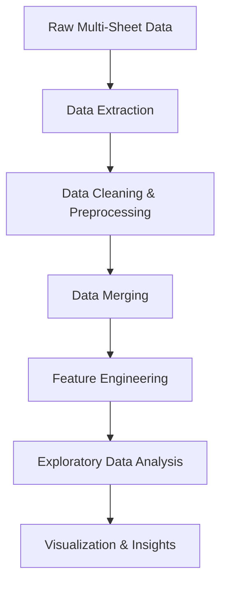

# -Retail-Sales-Analysis-Area-Product-Insights-Aug-25-Feb-26-
“Turning raw data into meaningful business decisions — one insight at a time.”
# 📊 Retail Sales Intelligence System

### Area-wise Product Performance & Demand Analytics (Aug 2025 – Feb 2026)

---

<p align="center">


</p>

---

## 📌 Project Overview

This project is a **data-driven retail sales intelligence system** designed to analyze and interpret multi-month transactional data.

It transforms raw Excel data into **structured insights** that help understand:

* Regional product demand
* Revenue concentration patterns
* Sales behavior across time

The focus is on delivering **business-relevant insights**, similar to real-world analytics use cases.

---

## 🎯 Problem Statement

Retail businesses often struggle with:

* Identifying **top-performing products by region**
* Understanding **sales variation across time**
* Optimizing **inventory and demand planning**

This project addresses these challenges through **systematic data analysis and visualization**.

---

## 📂 Dataset

* Multi-sheet Excel dataset (Aug 2025 – Feb 2026)
* Each sheet represents monthly transactional data

### Key Features:

* `AREA_NAME` — Location of sales
* `PRODUCT_NAME` — Product sold
* `UNITS_SOLD` — Quantity sold
* `GMV` — Revenue generated
* `ORDERED_DATE` — Transaction timestamp

---

## ⚙️ Methodology



---

## 🔍 Key Analysis

### 🔹 Area-wise Product Performance

* Aggregated total **units sold** and **revenue**
* Identified **top product per area**
* Compared performance across regions

---

### 🔹 Day-wise Demand Analysis

* Extracted day-level trends
* Identified **high-demand days**
* Observed temporal sales behavior

---

### 🔹 Revenue Distribution

* Analyzed contribution of products to total revenue
* Identified **high-impact products**

---

## 📊 Visualization

* 📈 Bar charts for revenue and units
* 📊 Comparative area-wise performance
* 📉 Trend-based day-wise analysis

---

## 📈 Key Insights

* 📌 Sales performance varies significantly across areas → **regional demand patterns**
* 📌 A small subset of products drives majority of revenue → **high-impact SKUs**
* 📌 Day-wise trends reveal **peak demand periods**

---

## 💼 Business Impact

This analysis can support:

* **Inventory Optimization** → Stock high-demand products region-wise
* **Sales Strategy** → Focus on top-performing SKUs
* **Demand Forecasting** → Use trends for future planning
* **Operational Efficiency** → Improve supply chain decisions

---

## 📁 Project Structure

```id="ks8m2x"
Retail-Sales-Intelligence/
│
├── Data/                  # Raw Excel dataset
├── Notebook/              # Jupyter Notebook (analysis)
├── Visualizations/        # Charts & outputs
└── README.md
```

---

## 🚀 How to Run

```bash id="f7s2pl"
git clone https://github.com/your-username/your-repo-name.git
cd your-repo-name
pip install pandas matplotlib
```

Run the notebook to reproduce the analysis.

---

## 💼 Author

**Himanshi Gupta**
Data Science | Data Analytics

---

## 🌟 Project Highlights

✔ End-to-end data pipeline (raw → insights)
✔ Multi-sheet data integration
✔ Business-oriented analysis
✔ Clean and interpretable visualizations
✔ Real-world analytics use case

---
